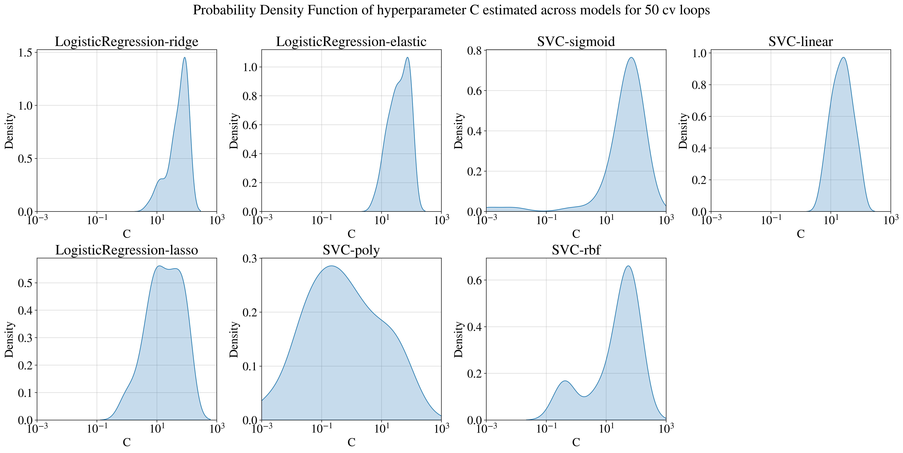

# Project Description
This project presents a machine-learning pipeline developed for hepatitis C virus (HCV) prediction. The aim is to assess the
performance of different classification algorithms in the task at hand and reliably select and optimize the hyperparameters of
the best-performing one. The baseline pipeline designed for HCV prediction consists of three main stages: data preprocessing,
model evaluation, and final model selection and tuning. The model evaluation stage utilizes a developed custom class
called `ClassifierCV`, compatible with the sci-kit learn API that performs classifier algorithm evaluation using nested cross-
validation trials and Bayesian hyperparameter tuning with optuna. The performance of several classification algorithms
was evaluated, including linear, rbf, sigmoid, poly-support vector machines (SVMs), K nearest neighbours (KNN), linear
discriminant analysis (LDA), Gaussian naive Bayes (GNB) and lasso,ridge, elastic logistic regression (LR). The results
indicate that SVMs with a liner kernel performed best on the 12-D feature space with Mathews Corelation Coefficient (MCC) 
score of $0.829$ after 50 nested cross validation trials.

The full technical report is attached `Techinal_Report.pdf` and is recommended over this summary.

# Loading and using the best model 
The best model selected by the developed pipeline is saved using the pickle library as `finalized_model.pickle` to load it you can execute the following code in a python file:
```
import pickle

with open('finalized_model.pickle' , 'rb') as file:
    model = pickle.load(file)   
```
From there on you can utilize it like any other sci-kit model, to make predictions and evaluate its perforance

# Dataset-Description


The dataset utilized consisting of 204 sam-
ples, comprising data on hepatitis C patients and
healthy blood donors. Each sample corresponds to
a patient’s ID, and 12 features are available for each
donor. To visualize the data-set, a t-SNE projection
based on the minimization of the Kullback-Leibler divergence between the estimated t-distribution kernel
density joint probability function of the data points
in the original high-dimensional space and a lower dimensional space was utilized.The first two features of the dataset capture the age and
sex of the donor, while the remaining features represent the levels of various molecules obtained from
blood chemistry results, specifically from liver function tests as presented in (table 1). Concerning the
target labels, the blood donors are binary classified
into healthy (label=0), or HCV positive (label=1). It’s
important to note that as with most medical datasets, the samples for the labels are imbalanced with
the HCV-positive class being the minority class and
accounting for 50% of the number of samples of the
majority HCV-negative class.

| **Feature**                     | **Category** |
|:-------------------------------:|:------------:|
| Age                             | Discrete     |
| Sex                             | Binary       |
| ALB (albumin)                   | Continuous   |
| ALP (Alkaline phosphatase)      | Continuous   |
| ALT (Alanine transaminase)      | Continuous   |
| AST (Aspartate transaminase)    | Continuous   |
| BIL (Bilirubin)                 | Continuous   |
| CHE (Cholinesterase)            | Continuous   |
| CHOL (Cholesterol)              | Continuous   |
| CREA (Creatinine)               | Continuous   |
| GGT (Gamma-glutamyltransferase) | Continuous   |
| PROT (Total Protein)            | Continuous   |

Many of the laboratory results featured in the data
set are measured in different scales, either units per
liter (U/L), grams per deciliter (g/dl) or milligrams
per deciliter (mg/dL). [2]. Additionally, the majority
of them include outliers, observations above or below
150% of the interquartile range (IQR) from the first and third quartile.

# Methodology
The main steps of the pipeline are:
1.  Preprocessing
2.  Model Evaluation
3.  Final Model Selection
4.  Final Model Tuning

*The schematic representation of the base pipeline is illustrated below*


# Results 
*The model evaluation results for each classifier category are summarized with the following graphs.*





# Possible Improvements
This pipeline serves as the base for HVC prediction by allowing for the evaluation of different classifiers. However
Reducing the feature space to five features using ANOVA
F-score and Mutual Information did not improve
the classification performance of the best-selected
model by the pipeline. Therefore, **we recommend
considering other feature selection methods and/or
increasing the number of top features**
. Currently,
ClassifierCV can only evaluate one classifier per class
call using nested cross-validation. To improve the
pipeline, **we suggest modifying ClassifierCV to read
classifiers from a list internally, eliminating the
need for looping and providing a cleaner and more
concise pipeline**. Regarding imbalanced datasets, the
cost-sensitive learning method we used is only one of
several methods to deal with them. **We recommend
utilizing additional methods, such as oversampling
with SMOTE, to extend the base pipeline presented
in this project.**
